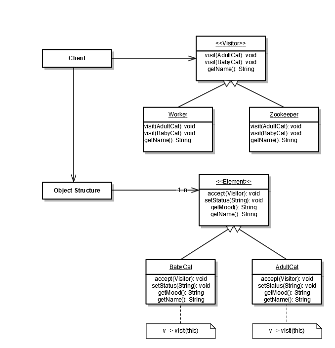
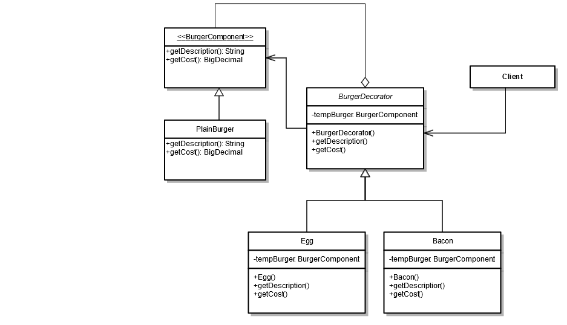

# Advanced Object Oriented Programming Course - Project 4 - Design Patterns

## Run the code
The main class is *src.client.Main* and you can compile the code and run the main method.

### Visitor Pattern
We used Visitor pattern to model a zoo with different types of zookeepers. Depending on the competence of the zookeeper that visits particular animals, the animals either thrive or not. 

### Decorator Pattern
We used Decorator pattern to model the building of a hamburger. Starting with a Plain Burger, this burger can be decorated, or enhanced, with bacon and an egg, and the cost can be calculated using this pattern.

